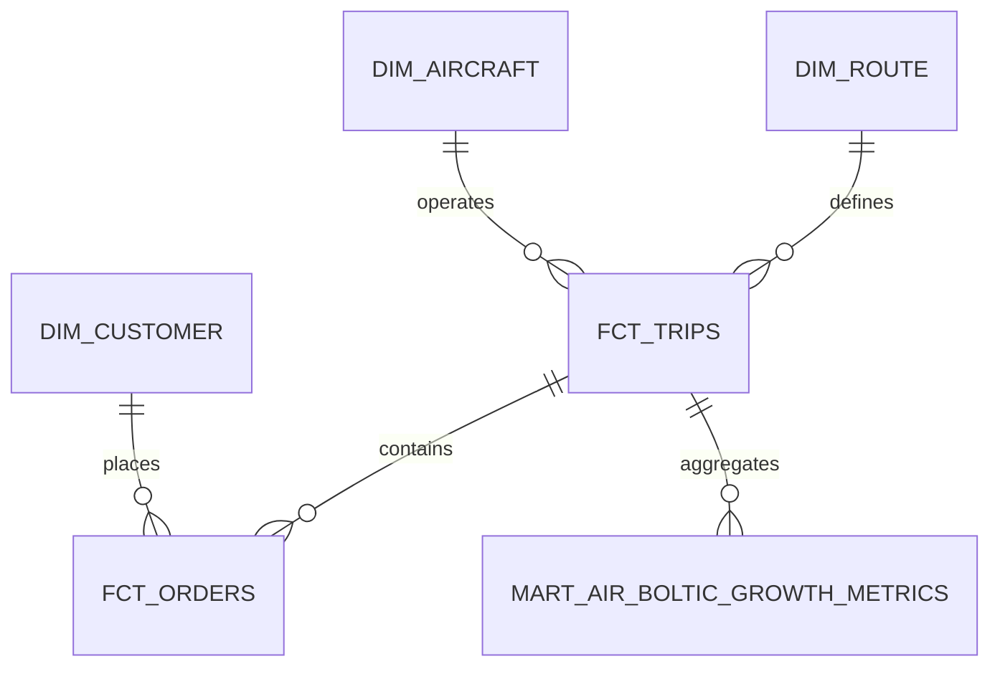

# Air Boltic Analytics Engineering Submission

## Executive Summary

Air Boltic is a two-sided marketplace: aircraft operators provide flight supply and customers purchase seats on trips. The main business problem is to understand why growth works in some regions/use cases and not in others, while keeping the service comparable with Bolt's existing business lines through consistent metrics such as active users, revenue, orders and supply utilisation.

My proposed solution is a layered analytics model using S3, Databricks, dbt and Looker. The model separates raw ingestion from cleaned staging tables, reusable intermediate logic and governed self-service marts. The most important output is a set of trusted facts and dimensions that allow business users to analyse growth by customer segment, route, aircraft type, price band, occupancy and order status.

## 1. Problem Understanding

### Business Problem

Bolt needs to identify the growth drivers of Air Boltic:

- Which customer segments are adopting the service?
- Which routes and trip types perform best?
- Which aircraft size/type is suitable for different use cases?
- How do DAU, WAU, MAU, revenue, order volume, cancellation and occupancy compare with other Bolt products?
- Where should the business increase supply, improve pricing, improve customer acquisition or stop investing?

### Technical Problem

The provided data is small, but the target state is global scale. The model therefore needs to handle:

- source ingestion from batch files, APIs and potentially SFTP vendors
- JSON flattening and schema evolution
- stable entity keys and clear table grain
- incremental transformations rather than full refreshes
- data quality checks for source completeness, referential integrity and metric correctness
- governed metric definitions for Looker and self-service users

### Expected Deliverables

| Deliverable | Included in this submission |
|---|---|
| Data model | ERD-style description and dbt model structure |
| Implemented repository | Staging, intermediate and mart dbt models with tests |
| Design explanation | Business and technical reasoning |
| More-time improvements | Included near the end |
| CI/CD process | Included for ideal and realistic cases |

### Hidden Evaluation Criteria

I assume the reviewers will look beyond whether the SQL runs. The likely evaluation areas are:

- understanding of marketplace metrics and table grain
- ability to design maintainable dbt layers
- practical data quality thinking
- ability to explain trade-offs instead of overengineering
- scalability for Databricks/S3
- clear communication to finance, marketplace and operations stakeholders
- ownership mindset: monitoring, lineage, documentation and CI/CD

## 2. Source Data Observations

| Source | Grain | Important notes from sample |
|---|---:|---|
| `customer` | customer | Some customers have missing group, email or phone |
| `customer_group` | group | Sample has only IDs 1-5, while customers reference IDs 6-10 |
| `aeroplane` | aircraft | Multiple aircraft can share the same model |
| `aeroplane_model.json` | manufacturer/model | Nested JSON needs flattening before joining |
| `trip` | trip | Two trips have end timestamp before start timestamp if treated as naive local time |
| `order` | seat order | Statuses are Finished, Booked and Cancelled |

The timestamp issue is important. For global aviation, origin and destination local times are not enough. In production I would store both local and UTC timestamps, plus airport/city timezone metadata.

As a basic sample validation, the current file contains 20 orders across 8 trips: 13 Finished, 5 Booked and 2 Cancelled. Using the definitions below, this gives EUR 28,800 gross booking value and EUR 18,900 realized revenue.

## 3. Proposed Data Model

### Conceptual ERD



### Core Tables

| Table | Grain | Purpose |
|---|---:|---|
| `dim_customer` | one row per customer | Customer profile, group, segment and lifetime value |
| `dim_aircraft` | one row per aircraft | Aircraft model, manufacturer, seats, range and size segment |
| `dim_route` | one row per origin-destination pair | Route-level analysis |
| `fct_orders` | one row per order/seat | Revenue, booking and customer demand analysis |
| `fct_trips` | one row per trip | Supply, route, occupancy and trip-level revenue |
| `mart_air_boltic_growth_metrics` | one row per date | Daily executive and Looker metric mart |

## 4. dbt Implementation Approach

### Staging Layer

Staging models perform only source cleanup:

- rename columns to snake case
- cast IDs, prices and timestamps
- standardise order status
- flatten the aircraft model JSON into a relational structure
- expose source-level quality tests

Examples:

- `stg_air_boltic__orders`
- `stg_air_boltic__trips`
- `stg_air_boltic__aeroplanes`
- `stg_air_boltic__aeroplane_models`

### Intermediate Layer

Intermediate models contain reusable business logic:

- `int_trip_bookings`: aggregates orders to trip level, calculating revenue, booked seats, cancelled seats and occupancy
- `int_customers_enriched`: joins customers to groups and lifetime purchase behaviour

### Mart Layer

The mart layer is designed for Looker and self-service analysis:

- `fct_orders`: seat/order-level fact
- `fct_trips`: trip-level fact
- `dim_customer`, `dim_aircraft`, `dim_route`: conformed dimensions
- `mart_air_boltic_growth_metrics`: daily growth and finance metrics

## 5. Metric Definitions

| Metric | Numerator | Denominator | Grain | Filters |
|---|---:|---:|---|---|
| DAU | distinct customers | not applicable | date | customers with an order on service date |
| WAU/MAU | distinct customers | not applicable | week/month | same logic as DAU |
| Gross booking value | sum of order price | not applicable | date/order/trip | Booked + Finished |
| Realized revenue | sum of order price | not applicable | date/order/trip | Finished only |
| Cancellation rate | cancelled orders | all orders | date/route/trip | all statuses |
| Occupancy rate | Booked + Finished seats | aircraft max seats | trip | exclude cancelled |
| Active aircraft | distinct aircraft | not applicable | date | aircraft with trips |
| Active routes | distinct origin-destination pairs | not applicable | date | routes with trips |

This avoids metric inconsistency because revenue, occupancy and active user logic are defined once in dbt and then reused in Looker.

## 6. Data Quality and Validation

### dbt Tests

| Check | Example |
|---|---|
| Primary key | `unique`, `not_null` on customer, order, trip and aircraft IDs |
| Relationships | orders to customers, orders to trips, trips to aircraft |
| Accepted values | order status in Finished, Booked, Cancelled |
| Non-negative values | price, max seats, max distance |
| Time validation | warn when trip end is before trip start |
| Occupancy range | warn if occupancy is outside 0-1 |

### Additional Validation Queries

```sql
-- Orders whose customer is missing
select o.*
from {{ ref('stg_air_boltic__orders') }} o
left join {{ ref('stg_air_boltic__customers') }} c
  on o.customer_id = c.customer_id
where c.customer_id is null;

-- Routes with high cancellation rate
select
    route_name,
    count(*) as orders,
    sum(case when order_status = 'CANCELLED' then 1 else 0 end) / count(*) as cancellation_rate
from {{ ref('fct_orders') }}
group by route_name
having cancellation_rate > 0.20;

-- Trips where sold seats exceed model capacity
select *
from {{ ref('fct_trips') }}
where booked_occupancy_rate > 1;
```

## 7. Pipeline Design

### Ingestion

For production I would land all source data into immutable S3 paths:

```text
s3://bolt-data/raw/air_boltic/{source_name}/ingestion_date=YYYY-MM-DD/run_id=...
```

Then Databricks would read these files and create raw Delta tables. dbt would transform Delta tables into staging, intermediate and mart schemas.

### Schema Evolution

| Change type | Handling |
|---|---|
| New nullable column | Allow, log and expose when useful |
| New required column | Add contract and backfill plan |
| Type change | Fail schema validation before mart impact |
| Missing column | Fail the ingestion run |
| New order status | Fail accepted value test, review with product/finance |

### Idempotency and Backfills

- Raw files are stored immutably with run ID and ingestion date.
- Transformations are partitioned by service date.
- Incremental models use merge keys such as `order_id`, `trip_id` and `metric_date`.
- Backfills can rerun a date range without duplicating data.
- Late-arriving orders update recent partitions using a 7-day lookback window.

### Monitoring and Alerting

| Area | Alert example |
|---|---|
| Freshness | No new orders by expected SLA |
| Volume | Orders drop by more than 30% day over day |
| Schema | Missing or incompatible source column |
| Referential integrity | Orders referencing unknown trip/customer |
| Metric anomaly | Revenue or cancellation rate outside historical range |
| Pipeline reliability | dbt model failure or Airflow task retry exhausted |

## 8. Scalability Considerations

- Store raw and curated data in Delta format on S3.
- Partition large fact tables by service date.
- Cluster/Z-order high-volume facts by `trip_id`, `customer_id`, `route_name` and `aircraft_id`.
- Use incremental dbt models for daily marts.
- Avoid full refresh for order and trip facts once the service scales.
- Keep dimensions narrow and conformed for Looker performance.
- Maintain semantic definitions centrally to avoid dashboard-specific metric drift.

## 9. Assumptions

- `order` grain is one customer buying one seat on one trip.
- `Price (EUR)` is the customer-facing order value before any take-rate or operator payout logic.
- `Finished` orders count toward realized revenue.
- `Booked` orders count toward gross booking value but not realized revenue.
- `Cancelled` orders are excluded from revenue and occupancy.
- `Trip ID` is the service date anchor for DAU/WAU/MAU because no separate order timestamp is provided.
- City names are used as route endpoints in the sample, but production should use airport/city dimension tables with country, region, timezone and coordinates.

## 10. Risks and Trade-offs

| Area | Risk | Decision |
|---|---|---|
| Timestamp handling | Local timestamps can create negative durations | Add warning now; production needs timezone-normalised UTC |
| Customer group quality | Some group IDs are missing in source | Do not drop customers; classify as Unknown group |
| Revenue definition | Real revenue may require commission/take-rate and refunds | Use order price as gross/revenue proxy until finance confirms |
| Small sample | Limited geography and no operator table | Design model to extend with operator, airport and pricing dimensions |
| Occupancy | Max seats may not equal configured sellable seats | Use model capacity now; production should store trip-level sellable capacity |

## 11. CI/CD: Ideal Process

With no tooling or resource limits, I would implement:

- separate `dev`, `staging` and `prod` Databricks environments
- branch-based dbt development with pull requests in GitHub
- dbt slim CI on changed models and downstream dependencies
- unit tests for business logic
- source freshness checks
- schema contracts for critical models
- static SQL linting and formatting
- data diff between production and pull request builds
- automatic lineage documentation update
- blue/green deployment for breaking mart changes
- release notes for metric changes
- stakeholder approval for finance-facing metrics

The process would be:

1. Engineer opens PR with model changes.
2. CI validates SQL, dbt compile, unit tests and slim CI.
3. PR environment builds changed models on sampled or recent production-like data.
4. Data diff compares row counts, aggregates and key metrics.
5. Reviewer checks code, model grain and documentation.
6. Merge deploys to staging, then production after scheduled validation.
7. Alerts monitor freshness, volume and metric anomalies after deployment.

## 12. CI/CD: Realistic Version With Limited Resources

If resources are limited, I would start with low-effort, high-impact controls:

| Priority | Action | Effort | Impact |
|---|---|---:|---:|
| Short term | GitHub PR reviews for all dbt changes | Low | High |
| Short term | `dbt compile` and `dbt test` in CI | Low | High |
| Short term | Source freshness and key relationship tests | Low | High |
| Short term | Basic Airflow/dbt failure alerts | Low | High |
| Medium term | Incremental models for large facts | Medium | High |
| Medium term | dbt docs and owner tags | Medium | Medium |
| Long term | Data contracts and data diff tooling | High | High |
| Long term | Separate staging/prod workspaces | High | High |
| Long term | Metric layer governance with approval workflow | High | High |

From my past experience, the highest ROI usually comes from clear model ownership, CI checks, and strong source/staging tests. In one previous analytics engineering project, adding dbt source tests, relationship checks and governance controls reduced downstream data issues significantly because problems were caught before reaching dashboards.

## 13. What I Would Do With More Time

- Add airport/city/country/timezone dimensions.
- Add operator/supplier dimension and aircraft availability model.
- Add order timestamp, cancellation timestamp and refund/take-rate fields.
- Build WAU/MAU retention and cohort models.
- Add route distance, flight duration and price-per-km metrics.
- Add semantic Looker model examples.
- Add anomaly detection for demand, revenue and cancellation.
- Add dbt unit tests for edge cases such as cancelled orders and overbooked trips.
- Add data product documentation with owners and SLAs.

## 14. Final Recommendation

I would prioritise a small but reliable data product: clean facts, conformed dimensions, governed growth metrics and strong data quality checks. For Air Boltic, the most useful first mart is not a complex dashboard-specific table, but a trusted foundation that lets finance, marketplace and regional teams ask their own questions consistently in Looker.

This design gives Bolt a scalable starting point for understanding where Air Boltic is growing, why it is growing, and which levers can be used to replicate success across markets.

## Use of External Aids

I used an AI assistant to help structure the written submission, review the repository layout and challenge the completeness of the data quality and CI/CD sections. The modeling choices, assumptions and trade-offs were reviewed against the provided sample data and the stated Bolt analytics stack.

## README-Style Reviewer Note

The repository demonstrates the most relevant part of the solution:

- dbt staging models for source cleanup
- intermediate models for reusable business logic
- mart models for self-service analytics
- schema tests for quality and reliability
- a conceptual Airflow DAG for ingestion and schema validation
- a JSON flattening script for aircraft model metadata

The code is intentionally compact. It focuses on model grain, metric clarity, maintainability and practical reliability rather than building a full deployment.

## Possible Interview Questions and Strong Answers

### 1. Why did you choose this star-schema style model?

I chose it because the main users need flexible self-service analysis by customer, route, aircraft and time. A star schema keeps facts at clear grains and dimensions reusable across dashboards. It also works well with Looker because metrics can be defined once and sliced consistently.

### 2. Why separate staging, intermediate and mart layers?

Staging keeps source cleanup simple and auditable. Intermediate models hold reusable business logic such as trip-level booking aggregation. Marts are designed for business consumption. This separation makes the project easier to maintain and reduces duplicated metric logic.

### 3. How would you handle the timestamp issue?

I would not trust naive local timestamps for a global flight marketplace. I would add city or airport timezone metadata, store UTC start and end timestamps, and keep local timestamps only for user-facing reporting. Until that is available, I would use a warning test rather than blocking all data.

### 4. What is the difference between gross booking value and realized revenue?

Gross booking value includes Booked and Finished orders because both represent demand and expected value. Realized revenue includes only Finished orders because those trips have actually happened. Cancelled orders are excluded from both revenue metrics.

### 5. How would you prevent metric inconsistency?

I would define the metrics centrally in dbt and Looker, document numerator, denominator, grain and filters, and avoid each dashboard recreating its own logic. For finance-facing metrics, I would require stakeholder approval before changing definitions.

### 6. How would this scale if Air Boltic becomes global?

I would store raw and curated data as Delta tables on S3, partition large fact tables by service date, use incremental dbt models, and cluster by common filter keys such as trip, route and customer. I would also add monitoring for freshness, volume, schema changes and metric anomalies.

### 7. What would you improve first in the source data?

I would add order timestamps, UTC trip timestamps, airport/country/timezone dimensions, operator IDs and trip-level sellable capacity. These fields are essential for accurate active-user metrics, route analysis, marketplace supply metrics and occupancy.
